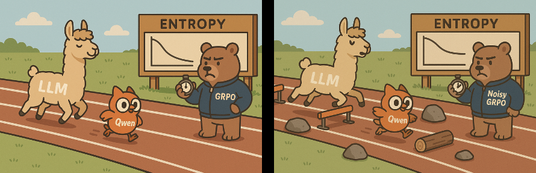

# Noisy RL



[BLOG](https://joshuaharrissite.substack.com/p/noisy-rl)

## About

This is a rough but very hackable implementation of GRPO + noise injection into LLM hidden states to test whether it increases exploration during on-policy RL. Details of initial experiments and results can be found in the blog linked above.


## Installation


Currently, this is implemented using just torch and transformers model implementations with a minimal list of dependencies (see requirements.txt).

Can be run with the docker below (plus wandb and reasoning-gym).

Docker: https://hub.docker.com/r/huggingface/transformers-all-latest-gpu

Then clone this repo.


## Noisy RL

To train a model on GSM8k using Noisy RL, complete a config using the example in configs/noise_grpo_qwen.yaml. Then run:

```python3 -m train.run --config=configs/noise_grpo_qwen.yaml --run_name='test'```
